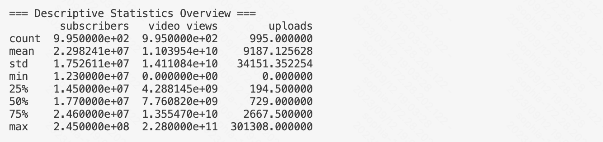

# Global YouTube Statistics 2023 

## Data

The data is from kaggle [Global YouTube Statistics](https://www.kaggle.com/datasets/nelgiriyewithana/global-youtube-statistics-2023). It has 28 columns with comprehensive details on top creators' subscriber counts, video views, upload frequency, country of origin, earnings, and more.

I downloaded `Global YouTube Statistics.csv` frrom kaggle and uploaded it into this resporitory.

## Setup

### 1. Update requirements.txt:
```
#script
pandas==2.0.3
matplotlib==3.7.2

```
### 2. Create a new python script `Descriptive_statistics_script.py`

### 3. Update Makefile

```
test:
	python -m pytest -vv --cov=main --cov=mylib Descriptive_statistics_script*.py

```

## Data Visualization

I analyse the top creators' subscriber counts, video views, upload frequency, country of origin, earnings.

### 1. Summary statistics using the describe method



### 2. Mean, Median and Mode


### 3. Variance and standard deviation

